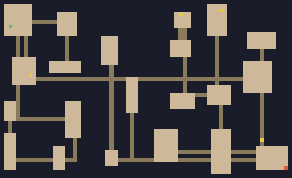
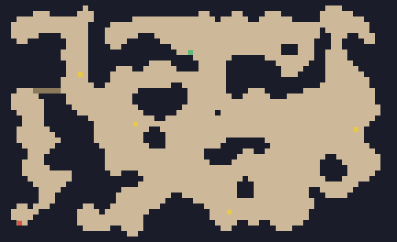
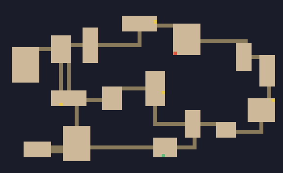
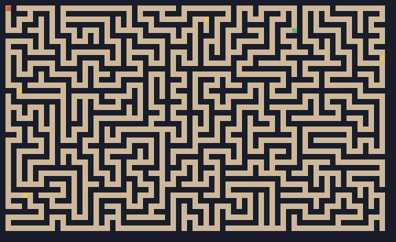
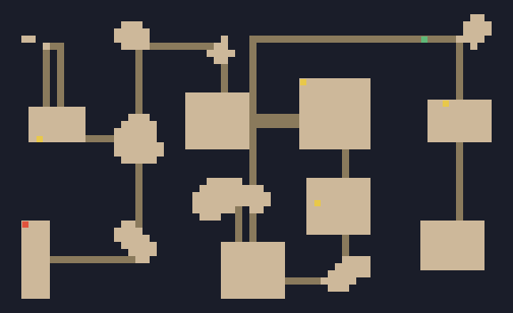
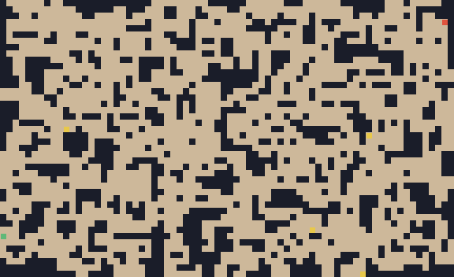

# 🗺️ 로그라이크 맵 생성기 (Roguelike Map Creator)


웹에서 동작하는 절차적 던전/맵 생성기. 9종 알고리즘을 선택해 실행하고, **시드로 동일한 맵을 재생성**한다.
빌드 도구 없이 순수 Vanilla JS + HTML5 Canvas — `index.html`만 열면 동작.

> 조사 근거: `docs/roguelike-research.md`, `docs/맵생성-알고리즘-정리.md`

## 미리보기

실제 생성기 출력(시드 고정, 시작🟢·출구🔴·보물🟡 마커):

| BSP 던전 | 셀룰러 동굴 | 그래프(들로네+MST) |
|---|---|---|
|  |  |  |
| **미로** | **하이브리드** | **WFC** |
|  |  |  |

> 이미지는 `node scripts/gen-screenshots.mjs`로 재생성 가능(헤드리스 PNG 인코딩).

## 실행

빌드 불필요. 정적 서버로 띄운다(ES module이라 `file://` 직접 열기는 CORS로 막힘):

```bash
cd roguelike_map_creator
python3 -m http.server 8000
# 브라우저에서 http://localhost:8000
```

## 핵심 기능

- **알고리즘 선택** — 시작 화면 카드에서 9종 중 선택, 언제든 변경
- **시드 재현** — 모든 무작위는 단일 시드 PRNG에서만 발생. 같은 `(알고리즘, 시드, 파라미터)` → 항상 동일한 맵
- **공유 코드 / URL 해시** — 설정 전체를 base64로 묶어 `#code=`로 링크 공유·복원
- **엔티티 배치** — 시작 / 출구(최장거리) / 보물(이격 배치), 시드 결정론
- **솔루션 경로** — 시작→출구 최단경로 오버레이
- **FOV 시각화** — 맵 클릭 지점 기준 재귀 섀도캐스팅 시야
- **생성 애니메이션** — CA·드렁큰·미로 생성 과정 재생/스크럽
- **다층 던전** — 1~8층, 상/하행 계단 연결, 층 네비게이션
- **비교 뷰** — 좌/우 패널 독립 알고리즘·시드·파라미터
- **내보내기 / 불러오기** — PNG·JSON 저장, JSON 불러오기
- **시드 갤러리** — localStorage 썸네일 저장/로드
- **성능 벤치마크** — 알고리즘×크기별 생성시간 측정

## 알고리즘 (9종)

| 알고리즘 | 설명 | 연결성 | 문서 |
|---|---|---|---|
| BSP 던전 | 공간 재귀 분할 → 방 배치 → 복도 연결 | 보장 | §1 |
| 셀룰러 오토마타 | 노이즈 반복 스무딩 → 유기적 동굴 | 사후 연결 | §2 |
| 드렁큰 워크 | 에이전트 무작위 굴착 | 보장 | §3 |
| 룸+코리더 (터널링) | 방 배치 + L자/A* 터널 | 보장 | §4 |
| 미로 (재귀 백트래커) | 스택 DFS 미로, braid 옵션 | 보장 | §5 |
| 그래프 (들로네+MST) | 들로네 삼각분할 → MST → 루프 재추가 | 보장 | §6 |
| 하이브리드 | BSP 구획 + 셀룰러 동굴 혼합 | 보장 | §0 |
| WFC (타일) | 소켓 타일 제약전파 | 사후 연결 | §7 |
| WFC Overlapping | 샘플 패턴 학습 합성 | 사후 연결 | §7 |

연결성 미보장 기법은 `connectRegions`로 분리 영역을 사후 연결한다.

## 구조

```
index.html              진입점, UI
css/style.css           다크 테마
js/
  rng.js                시드 PRNG (FNV 해시 + mulberry32) — 유일 난수원
  grid.js               Grid, 타일상수, floodRegions/connectRegions/carveTunnel/bfsDistance/carveAStarPath
  registry.js           알고리즘 등록부 (파라미터 스키마 → UI 자동생성)
  render.js             Canvas 렌더 (타일/엔티티/경로/FOV 오버레이)
  buildmap.js           맵 빌드 코어 (DOM 비의존)
  dungeon.js            다층 던전 + 계단
  entities.js           엔티티/계단 배치, 솔루션 경로
  fov.js                재귀 섀도캐스팅
  export.js / io.js     PNG·JSON 내보내기 / 불러오기
  gallery.js            시드 갤러리 (localStorage)
  bench.js              성능 벤치마크
  app.js                메인 (슬롯 기반 상태, UI 바인딩, 공유코드)
  algorithms/           bsp · cellular · drunkard · tunneling · maze · graph · hybrid · wfc · wfc-overlap
  lib/                  bsp-core · delaunay · astar · wfc-tileset
docs/                   리서치 문서
```

## 재현성 설계

- `js/rng.js`의 시드 PRNG가 **유일한 무작위 출처** (`Math.random` 미사용)
- 추가 난수 소비처(엔티티, 다층 층별, WFC 재시도)는 파생 시드 `makeRNG(seed + ":ns")`로 격리 → 기존 맵 재현성 불변
- A* 복도/들로네/A* 길찾기는 결정론적 tie-break(인덱스 기준)

## 기술 스택

Vanilla JavaScript (ES modules), HTML5 Canvas, CSS. 외부 의존성 없음.
